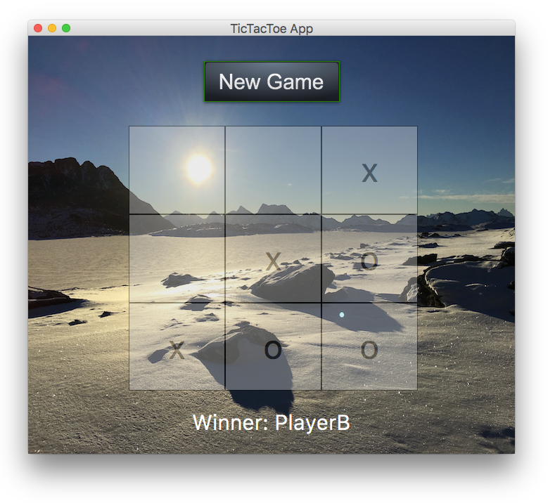

# fx-tictactoe

A tic tac toe game with a javafx gui ready to be deployed on an android device.

# Background

Originally written for the desktop, this application showcases how one could use JavaFX technology
to deploy applications to an Android device.

## Building

This project uses [Gradle](http://www.gradle.org/). You have to use a rather recent version of gradle, like 2.10 or above.
More precisely, the project relies on the javafxmobile-plugin, which introduces some special
configuration directives which makes it possible to create not only android but also ios apps.

For example, the res folder should be placed in _src/android_ - for more details see the
[javafxmobile-plugin website](http://docs.gluonhq.com/javafxports/)

## How to build and deploy to an android device

You should be able to build everything by issuing

    gradle android

If this runs through successfully, you can deploy a debug apk on a connected device with

    gradle androidInstall

## How to test

You can test your JavaFX App directly on your developer machine by issuing

    gradle run

... which is quite nice to debug application specific features :)

## How to get everything to the play store

You should definitely consult the [jfxmobile-plugin documentation](http://docs.gluonhq.com/javafxports/#_android_4), but here is the recipe for the impatient reader:

  - Add signing configuration to your app
  - create a AndroidManifest.xml
  - Add a nice icon ;-)
  - gradle androidRelease

The last command creates a ready to deploy android apk under ./build/javafxports/android/fx-tictactoe.apk.

About signing: You'll need a keystore file - [Read about signing android apps here](https://developer.android.com/tools/publishing/app-signing.html)

## License

Licensed under Apache License 2.0.
